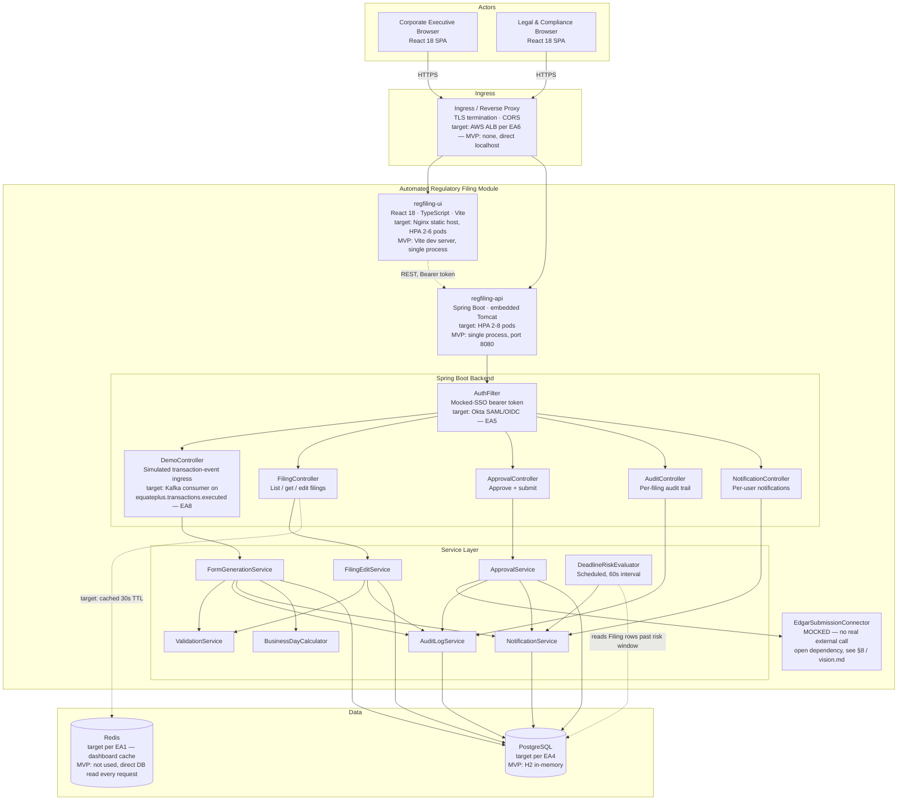
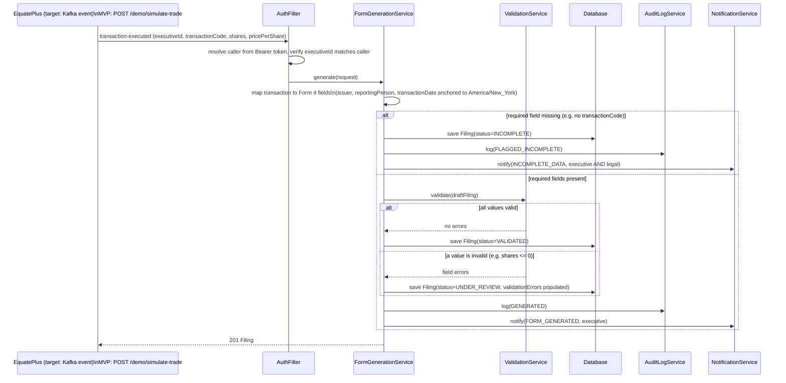
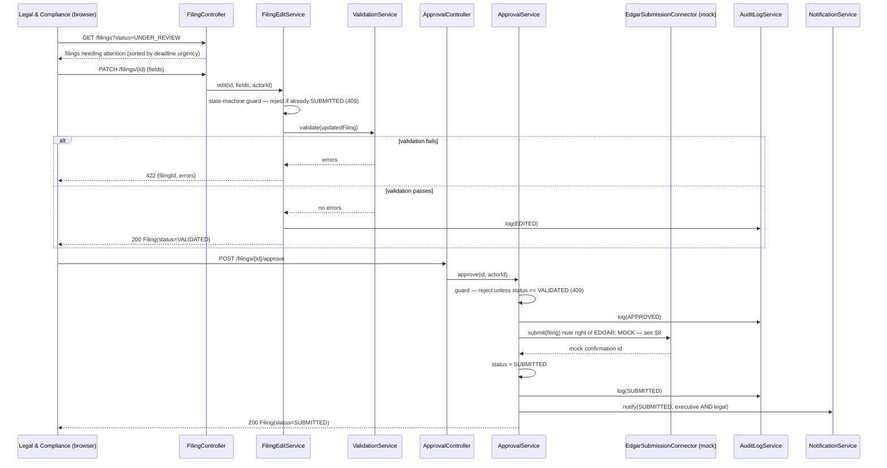
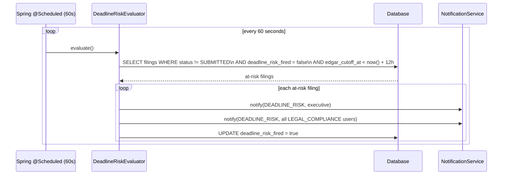
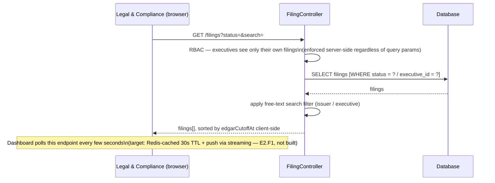
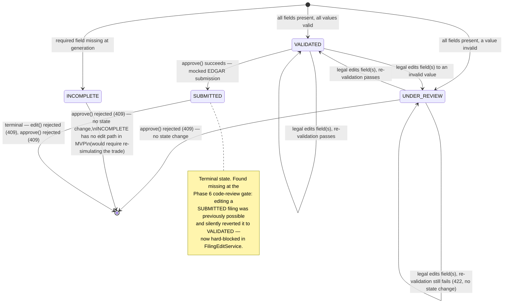
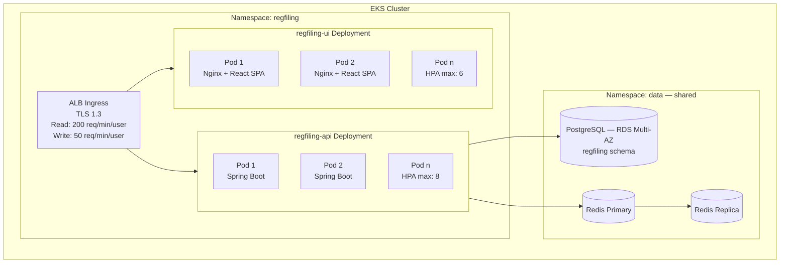
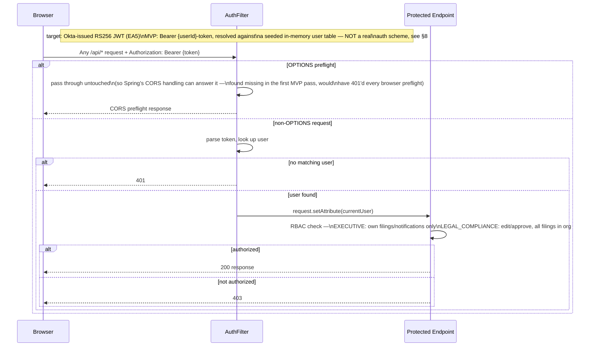

# High-Level Design (HLD)
**Document Version:** 2.0.0 (revised — see §0 for what changed and why)
**Baseline Reference:** `kb-L1-computershare-enterprise-architecture.md` v1.0.0
**Feature Coverage:** E1.F1–F4, E2.F2, E2.F3 (MVP-committed, Cycle 1) · E2.F1, E2.F4, E2.F5, E3.F1–F4 (designed, not built — see §8)
**Stack:** Java 17 + Spring Boot 3.x + PostgreSQL (target) / H2 (MVP demo) · React 18 + TypeScript + Vite (frontend)
**Correlation ID:** `C885C23C-949E-440C-8B0E-04FDD166A559`

---

## 0. Revision note

Version 1.0.0 of this HLD (produced in Phase 4) was a single-page component table and a short data-flow list — accurate but too thin to actually design or review against, per your feedback. This revision restructures the document around the same pattern as a mature enterprise HLD: a system component diagram, one sequence diagram per real flow, an explicit state machine, a deployment view (grounded in `kb-L1-computershare-enterprise-architecture.md`'s target stack, with the MVP's actual local-process reality called out separately rather than conflated with it), a security view, an observability section, and an NFR compliance table. Nothing in v1.0.0 was factually wrong; it just didn't have enough surface to design from. All feature/story IDs below are epics-from-prd.md's real E#.F# IDs (realigned from the earlier simulated FEAT-N numbering).

---

## 1. System Component Diagram



**What changed vs. a from-scratch design:** this is a net-new module (no existing EquatePlus service does automated filing generation today — see `docs/sdlc/phase-1-requirements/impact-assessment.md` §1), so there is no legacy component to integrate around. The brownfield constraint is entirely upstream (consuming a real transaction-execution signal from EquatePlus) and downstream (submitting to SEC EDGAR) — both are explicit open integration points, mocked in this MVP and called out in §8.

---

## 2. Data Flow Diagrams

### 2.1 Transaction Event → Form Generation [E1.F1 · E1.F1-S1, E1.F1-S3]



### 2.2 Legal Review, Edit & Approval [E1.F2, E1.F3 · E1.F2-S1, E1.F3-S1, E1.F3-S2, E1.F3-S3]



### 2.3 Deadline-Risk Evaluation [E2.F2 · E2.F2-S2]


Note: fires against `edgar_cutoff_at` (the EDGAR 5:30pm ET same-day cutoff), never `deadline_at` (the raw 2-business-day statutory deadline) — see `docs/sdlc/phase-0-vision/vision.md` Regulatory Posture #2. `deadline_risk_fired` makes this idempotent; a filing is only ever alerted on once.

### 2.4 Compliance Dashboard [E2.F3 · E2.F3-S1, E2.F3-S2]



---

## 3. Filing State Machine [E1.F1–F3 · BL — business logic]



### State summary

| State | Reachable from | Approve allowed | Edit allowed |
|---|---|---|---|
| `INCOMPLETE` | Generation, missing required field | No (409) | No (no code path in MVP) |
| `UNDER_REVIEW` | Generation (invalid value) or edit (invalid value) | No (409) | Yes |
| `VALIDATED` | Generation (valid) or edit (now valid) | Yes | Yes |
| `SUBMITTED` | Approve | No (409, terminal) | No (409, terminal) |

`GENERATED`, `EDITED`, `APPROVED`, `SUBMITTED`, `FLAGGED_INCOMPLETE` are `AuditAction` values (what happened), never `FilingStatus` values (what state the filing rests in) — these are deliberately different enums; see LLD §1.

---

## 4. Deployment View

### 4.1 Target (per `kb-L1-computershare-enterprise-architecture.md` EA6)



| Service | Image Base | Port | Resources (request/limit) | Probes |
|---------|-----------|------|--------------------------|--------|
| regfiling-ui | `nginx:alpine` (multi-stage: `node:20-alpine` build → nginx serve) | 80 | 100m/500m CPU · 128Mi/256Mi | `/` (200) |
| regfiling-api | `eclipse-temurin:17-jre-alpine` | 8080 | 250m/1000m CPU · 256Mi/512Mi | `/actuator/health` (target — not yet added, see §8) |

### 4.2 MVP reality (this repo, right now)

```
┌─────────────────────────────┐      ┌──────────────────────────────┐
│  npm run dev (Vite)         │      │  mvn spring-boot:run          │
│  regfiling-ui                │─────▶│  regfiling-api                │
│  http://localhost:5173      │ REST │  http://localhost:8080/api    │
│  (single process, no HPA,   │      │  (single process, no HPA,     │
│   no build, hot-reload)     │      │   embedded H2, no PostgreSQL) │
└─────────────────────────────┘      └────────────┬───────────────────┘
                                                    │
                                          ┌─────────▼─────────┐
                                          │  H2 in-memory DB   │
                                          │  (data lost on     │
                                          │   process restart) │
                                          └────────────────────┘
```
No Kubernetes, no ALB, no Redis, no PostgreSQL, no CI pipeline runs this MVP — it is two local processes on a developer machine, by design (demo scope). §8 is the authoritative gap list between this and §4.1.

---

## 5. Security View



### Encryption boundaries

| Boundary | Target (EA5) | MVP reality |
|----------|-----------|----------|
| Browser → API | TLS 1.3 | Plain HTTP, localhost only |
| API → Database | TLS 1.2+ | N/A — H2 embedded, no network hop |
| Auth token | RS256, Okta-issued | Opaque mocked token, no signature |

### Authorization matrix (as actually enforced in code, post code-review fixes)

| Endpoint | Executive | Legal & Compliance |
|---|---|---|
| `POST /demo/simulate-trade` | Own `executiveId` only (403 otherwise — found missing, fixed) | Not applicable (executives simulate their own trades) |
| `GET /filings` | Own filings only, forced server-side | All filings in scope |
| `GET /filings/{id}` | Own filing only (403 otherwise) | Any filing |
| `PATCH /filings/{id}` | Forbidden (403) | Yes |
| `POST /filings/{id}/approve` | Forbidden (403) | Yes |
| `GET /filings/{id}/audit-log` | Own filing only (403 otherwise — found missing, IDOR, fixed) | Any filing |
| `GET /notifications?userId=` | Own `userId` only (403 otherwise — found missing, IDOR, fixed) | Own `userId` only |

---

## 6. Observability

| Signal | Target (EA9) | MVP reality |
|--------|------|------------|
| Structured logs | SLF4J + Logback JSON, correlationId on every line | Default Spring Boot console logging, no correlation ID propagation yet |
| Metrics | Micrometer → Prometheus | Not instrumented |
| Health probes | `/actuator/health` | Not added (Spring Boot Actuator not on the classpath) |
| Tracing | OpenTelemetry | Not instrumented |
| SDLC-level audit trail | — | `docs/sdlc/audit-log.jsonl` — a correlation-ID-tracked event log of the *design and construction process itself* (every phase, gate, finding, fix), distinct from application-runtime observability above |

This is the clearest gap between the target architecture and the MVP: application-level observability (§6) was not a priority for a two-process local demo, whereas *process*-level observability (the SDLC audit log) was built from Phase 0 onward because it's the point of the demo. Both are real gaps worth being honest about, not silently merged into one "observability: done" claim.

---

## 7. NFR Compliance Summary

| NFR (from PRD/EA7) | Target | MVP status |
|-----|--------|-----------|
| Form generation < 5 minutes | Async pipeline, indexed queries | **Met trivially** — synchronous generation, sub-second in practice at demo scale; the 5-minute budget is not stress-tested |
| Dashboard refresh < 1 minute | Redis-cached streaming | **Met by polling**, not the target streaming architecture (E2.F1 not built) |
| 99.9% availability | Multi-AZ RDS, HPA, K8s | **Not applicable** — single-process local demo has no HA story |
| 10,000 concurrent users / 1,000 trades/min | Horizontal scaling, connection pooling | **Not load-tested** — H2 single-connection-pool cannot approach this; PostgreSQL + HPA is the target path |
| WCAG 2.1 AA | Full audit | **Partially applied** — semantic HTML, `aria-live`, labeled inputs, no emoji-as-icon (see `computershare-design-system.md` EA11); no automated axe-core audit run |
| Zero critical vulnerabilities | SonarQube + Trivy + OWASP Dependency-Check | **Not scanned** — no CI pipeline runs against this repo |

---

## 8. Gap Register — Target Architecture vs. This MVP

Consolidated from §2–§7 so the brownfield-vs-demo distinction is in one place, not scattered:

| # | Gap | Target (EA reference) | Owner of the resolution |
|---|---|---|---|
| 1 | SEC EDGAR submission is fully mocked | EA8 — real integration mechanism is an open architectural question | Legal & Compliance to confirm direct-filer-API vs. agent-handoff (Phase 0 regulatory finding) |
| 2 | Auth is a mocked bearer token, not Okta SSO | EA5 | Platform/Identity team — swap `AuthFilter` for a real OIDC/SAML validator; interface shape (Bearer JWT) is already compatible |
| 3 | H2 in-memory, not PostgreSQL | EA1, EA4 | This module's own next iteration — `db-schema.sql` already documents the real target schema |
| 4 | No Kafka event consumption; trigger is a mocked HTTP endpoint | EA8 | Requires the real EquatePlus transaction-engine event contract to be defined |
| 5 | No Kubernetes deployment, no HPA, no ALB | EA6 | Standard platform onboarding once the module leaves demo status |
| 6 | No Redis caching layer | EA1 | Add once dashboard read volume justifies it — premature at demo scale |
| 7 | No application-level observability (metrics, tracing, health probes) | EA9 | Add Spring Boot Actuator + Micrometer before any staging deployment |
| 8 | No CI security scanning | EA1, EA14 | Wire up GitHub Actions per EA6's pipeline shape before production |

Every gap above is cross-referenced from the point in this document where it matters, and again from `docs/sdlc/phase-6-construction/CHANGELOG.md` — this list is the single source of truth for "what's real vs. what's demo" so it doesn't drift across documents.
