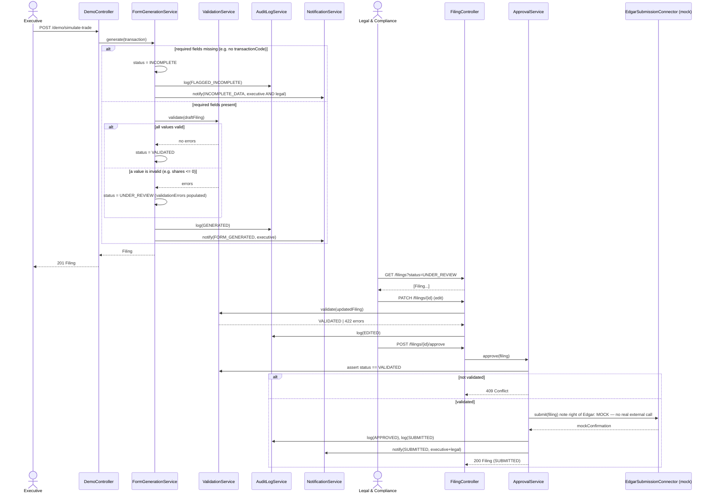

# Low-Level Design — Automated Regulatory Filing Module

**Agent:** `L1-design-lld` · **Phase:** 4 · **Correlation ID:** `C885C23C-949E-440C-8B0E-04FDD166A559`
**Inputs:** [hld.md](hld.md) · [openapi.yaml](openapi.yaml)

## Package structure (Spring Boot, `api/`)

```
com.computershare.regfiling
 ├─ web/            REST controllers (1:1 with openapi.yaml paths)
 │   ├─ DemoController          POST /demo/simulate-trade
 │   ├─ FilingController        GET/PATCH /filings, /filings/{id}
 │   ├─ ApprovalController      POST /filings/{id}/approve
 │   ├─ AuditController         GET /filings/{id}/audit-log
 │   └─ NotificationController  GET /notifications
 ├─ service/
 │   ├─ FormGenerationService    (form-generation-engine)
 │   ├─ ValidationService        (validation-engine)
 │   ├─ ApprovalService          (review-approval-workflow)
 │   ├─ EdgarSubmissionConnector (edgar-submission-connector — MOCKED impl)
 │   ├─ AuditLogService          (audit-log-service)
 │   ├─ NotificationService      (notification-service)
 │   └─ DeadlineRiskEvaluator    (computes against edgarCutoffAt, not raw deadlineAt)
 ├─ domain/          Filing, FilingField, AuditLogEntry, Notification, FilingStatus (enum)
 ├─ repository/      Spring Data JPA repositories, one per aggregate root
 ├─ template/        FormTemplateRegistry + Form4Template (form-template-registry)
 └─ security/        Mocked-SSO bearer token filter + role check (EXECUTIVE / LEGAL_COMPLIANCE)
```

## Sequence — Generate → Review → Approve (golden path)



## Error handling

| Condition | HTTP | Behavior |
|---|---|---|
| Missing required transaction field on generation | 201 (still created) | `Filing.status = INCOMPLETE` (never transitions to `UNDER_REVIEW`), `AuditLogEntry(FLAGGED_INCOMPLETE)`, notification to **both** executive and legal (per user-journeys.md drop-off-risk decision) |
| All required fields present, all values valid on generation | 201 | `Filing.status = VALIDATED` directly — immediately approvable. `GENERATED` is only the audit-log action name, not a resting status. |
| All required fields present, an invalid value on generation | 201 | `Filing.status = UNDER_REVIEW` with `validationErrors` populated — this is what makes the review queue (`GET /filings?status=UNDER_REVIEW`) meaningful: filings there need an edit, not just a glance. |
| `PATCH` produces an invalid field value | 422 | `ValidationErrorResponse` with field-level messages; filing status remains `UNDER_REVIEW`, not silently advanced |
| `approve` called on a non-`VALIDATED` filing | 409 | No state change, no audit entry beyond the rejected attempt (logged at DEBUG, not written to the compliance audit trail) |
| Unknown filing id | 404 | Standard not-found body |
| Missing/invalid mocked-SSO bearer token | 401 | No business logic executed |
| Executive attempts `approve` (wrong role) | 403 | RBAC enforced in `security/` filter before controller logic runs |

## DeadlineRiskEvaluator logic (carries forward vision.md Regulatory Posture #2)

```
edgarCutoffAt = businessDayCutoff(transactionDate, +2 business days, 17:30 America/New_York)
if status not in {SUBMITTED} and now() >= edgarCutoffAt.minusHours(12):
    raise DEADLINE_RISK notification (idempotent — one per filing, not re-fired every poll)
```
Explicitly NOT `deadlineAt.minusHours(12)` — the 5:30pm ET same-day EDGAR cutoff is stricter than the raw calendar deadline and is what the notification must key off, per the Phase 0 regulatory finding.
