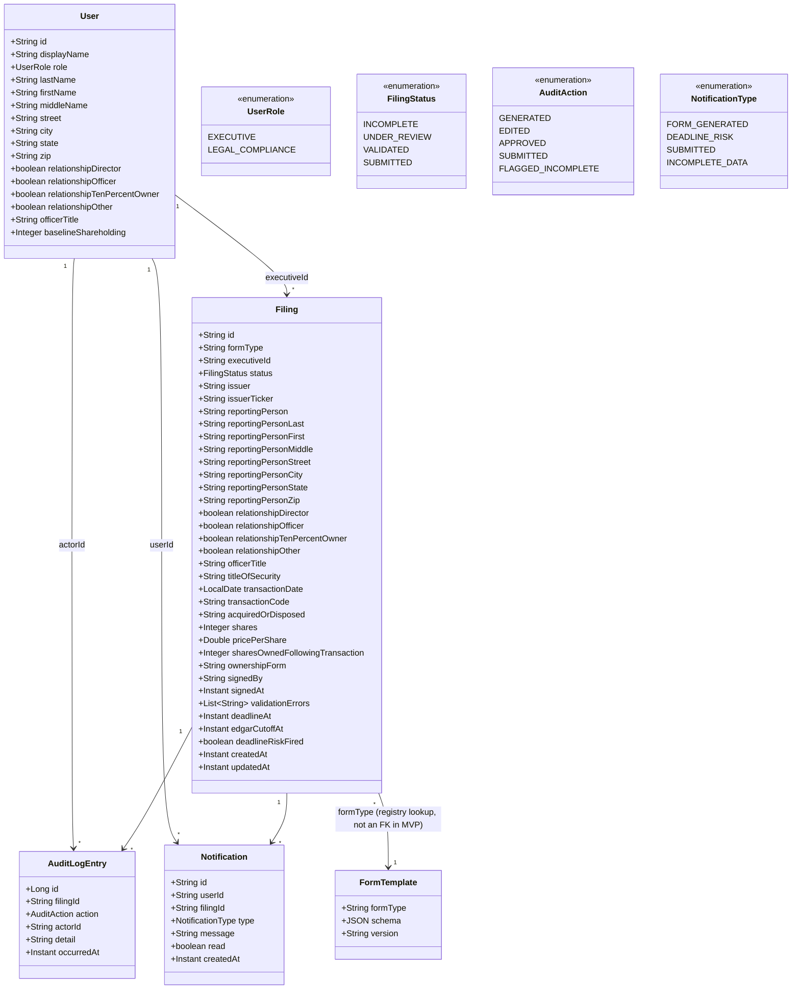

# Low-Level Design (LLD)
**Document Version:** 2.1.0 (revised — see §0)
**Baseline Reference:** `kb-L1-computershare-enterprise-architecture.md` v1.0.0
**Feature Coverage:** E1.F1–F4, E2.F2, E2.F3 (MVP-committed)
**Stack:** Java 17 + Spring Boot 3.3.4 + Spring Data JPA + H2 (MVP) / PostgreSQL (target) + Apache PDFBox 3.0.8 (Form 4 PDF export)
**Correlation ID:** `C885C23C-949E-440C-8B0E-04FDD166A559`

---

## 0. Revision note

Version 1.0.0 covered the package structure, one sequence diagram, and a short error table. Version 2.0.0 added the domain model as a proper class diagram, formal per-table schema documentation (mirroring the actual `db-schema.sql`), a migration plan, per-endpoint CQRS-style handler specifications (input/validation/business-logic/output, matching every real controller method in `api/src/main/java`), a validation-rules reference table, a full state-transition table, an API error-response reference, and test-coverage requirements tied to the actual 9 backend + 5 frontend tests. All feature/story references use epics-from-prd.md's real E#.F#-S# IDs.

**Version 2.1.0** expands `Filing`/`User` to the real SEC Form 4 field set (reporting-person name/address, issuer ticker, relationship to issuer, Table I transaction detail, a signature block) so the review screen and a new downloadable PDF genuinely resemble a pre-filled regulatory form, and adds a signature precondition to the approve handler (§4.5) plus a new PDF-download handler (§4.8).

---

## 1. Domain Model



**MVP simplification vs. this diagram's implication:** `Filing` models Form 4's fields as direct columns (`issuer`, `reportingPerson`, …) rather than a generic `fields` JSONB blob, since only one `FormTemplate` (`FORM_4`) is registered. The `FormTemplate` relationship is therefore a registry lookup by string key in application code, not a real foreign key — see `db-schema.sql`'s own note on this, and E3.F3 (Extensibility) for what a real multi-form data model would need.

**`User`'s Form 4 profile fields are nullable and populated only for `EXECUTIVE`-role rows** (`FormGenerationService` copies them onto every `Filing` that executive generates, so a given person's identity stays consistent across all their filings, rather than being re-randomized per trade). `LEGAL_COMPLIANCE` users are never looked up as a filing's executive, so these stay null for `legal-1`/`legal-2` — not a gap, just data that has no meaning for that role.

**`Filing.sharesOwnedFollowingTransaction` is a point-in-time snapshot, not a running ledger**: `FormGenerationService` computes it once, at generation time, as the executive's seeded `baselineShareholding` plus or minus that single transaction's `shares` (sign per `acquiredOrDisposed`). It is not recomputed if `shares`/`acquiredOrDisposed` are edited afterward via PATCH, and it does not account for the executive's other filings — a deliberate MVP simplification, not a bug; a real implementation would need a genuine cumulative-holdings ledger. `acquiredOrDisposed` itself defaults from `transactionCode` (S/D→Disposed, P/A→Acquired) at generation and is independently editable afterward.

---

## 2. Database Schema

> Full DDL: `docs/sdlc/phase-4-design/db-schema.sql` (PostgreSQL, the target — see EA4). The MVP runs on H2 with Hibernate `ddl-auto: update` generating an equivalent schema from the JPA entities directly; the two are kept conceptually aligned but H2 does not execute `db-schema.sql` verbatim (no JSONB support, different reserved words — `user` required an explicit `@Table(name="users")` override, documented inline in `User.java`).

### 2.1 `filings`

| Column | Type (target Postgres) | Constraints | Notes |
|--------|------------|-------------|-------|
| id | VARCHAR(64) | PK | UUID string |
| form_type | VARCHAR(32) | NOT NULL DEFAULT 'FORM_4' | Registry key — form-template-registry (E3.F3) |
| executive_id | VARCHAR(64) | NOT NULL FK → users.id | |
| status | VARCHAR(32) | NOT NULL CHECK IN (INCOMPLETE, UNDER_REVIEW, VALIDATED, SUBMITTED) | `GENERATED`/`APPROVED` are `audit_log.action` values, never resting statuses — see LLD §5 |
| issuer | VARCHAR | | MVP: hardcoded demo issuer, no multi-issuer directory |
| issuer_ticker | VARCHAR | | e.g. `ASND` — paired with `issuer`, also hardcoded |
| reporting_person | VARCHAR | | Executive's display name at generation time |
| reporting_person_last / _first / _middle | VARCHAR | \_middle nullable | Copied from `User` at generation, editable after |
| reporting_person_street / _city / _state / _zip | VARCHAR | | Copied from `User` at generation, editable after |
| relationship_director / _officer / _ten_percent_owner / _other | BOOLEAN | NOT NULL | Multiple may be true at once, mirrors the real form's checkbox group |
| officer_title | VARCHAR | nullable | Meaningful only when `relationship_officer` is true |
| title_of_security | VARCHAR | | Table I col. 1; defaults to `Common Stock` |
| transaction_date | DATE | | Anchored to `America/New_York` (found as a timezone bug at code review — see review-report.md) |
| transaction_code | VARCHAR | | S / P / A / D |
| acquired_or_disposed | VARCHAR | | Table I col. 4b, `A` or `D` — distinct from `transaction_code`; defaulted from it at generation, independently editable after |
| shares | INTEGER | | Must be > 0 to validate |
| price_per_share | DOUBLE | | Must be >= 0 to validate |
| shares_owned_following_transaction | INTEGER | | Executive's seeded baseline ± this transaction's shares — a snapshot, not a running ledger (see §1) |
| ownership_form | VARCHAR | | `D` (Direct) or `I` (Indirect); defaults to `D` |
| signed_by | VARCHAR | nullable | Set via an explicit PATCH before approval will succeed — never auto-stamped |
| signed_at | TIMESTAMPTZ | nullable | Server-stamped only by `ApprovalService.approve()` at the moment of successful approval; not client-editable (excluded from the PATCH-editable field set) |
| validation_errors | (element collection, `filing_validation_errors` table) | | EAGER fetch — required since the entity serializes outside an open Hibernate session (`open-in-view: false`); LAZY would throw on serialization (found and fixed during construction) |
| deadline_at | TIMESTAMPTZ | NOT NULL | Raw statutory 2-business-day deadline |
| edgar_cutoff_at | TIMESTAMPTZ | NOT NULL | Effective EDGAR 5:30pm ET same-day cutoff — deadline-risk logic keys off **this** |
| deadline_risk_fired | BOOLEAN | NOT NULL DEFAULT false | Idempotency guard for the DEADLINE_RISK notification |
| created_at / updated_at | TIMESTAMPTZ | NOT NULL | |

**Indexes:** `status`; `executive_id`; partial index on `edgar_cutoff_at WHERE status <> 'SUBMITTED'` (matches `DeadlineRiskEvaluator`'s query shape exactly).

### 2.2 `audit_log` (append-only)

| Column | Type | Constraints | Notes |
|--------|------|-------------|-------|
| id | BIGSERIAL | PK | |
| filing_id | VARCHAR(64) | NOT NULL FK → filings.id | |
| action | VARCHAR(32) | NOT NULL CHECK IN (GENERATED, EDITED, APPROVED, SUBMITTED, FLAGGED_INCOMPLETE) | |
| actor_id | VARCHAR(64) | NOT NULL FK → users.id | |
| detail | TEXT | | Target Postgres `TEXT` is unbounded; the MVP's H2/JPA-derived column is `@Column(length = 2000)` (explicit, since Hibernate's unannotated default is `VARCHAR(255)`) — widened after a live PATCH that touched every Form 4 field at once produced a "Fields updated: [...]" detail string longer than 255 chars and threw a 500 |
| occurred_at | TIMESTAMPTZ | NOT NULL | |

No `UPDATE`/`DELETE` code path in `AuditLogService` targets this table — append-only by construction, not just convention, matching EA4/EA12's regulatory retention posture.

### 2.3 `notifications`

| Column | Type | Constraints | Notes |
|--------|------|-------------|-------|
| id | VARCHAR(64) | PK | |
| user_id | VARCHAR(64) | NOT NULL FK → users.id | |
| filing_id | VARCHAR(64) | FK → filings.id | |
| type | VARCHAR(32) | NOT NULL CHECK IN (FORM_GENERATED, DEADLINE_RISK, SUBMITTED, INCOMPLETE_DATA) | |
| message | TEXT | NOT NULL | |
| read | BOOLEAN | NOT NULL DEFAULT false | Not yet surfaced in the UI — notifications are always shown as unread in the MVP panel |
| created_at | TIMESTAMPTZ | NOT NULL | |

### 2.4 `users`

| Column | Type | Constraints | Notes |
|--------|------|-------------|-------|
| id | VARCHAR(64) | PK | |
| display_name | VARCHAR | NOT NULL | |
| role | VARCHAR(32) | NOT NULL CHECK IN (EXECUTIVE, LEGAL_COMPLIANCE) | |
| last_name / first_name / middle_name | VARCHAR | nullable | Form 4 reporting-person identity — populated for `EXECUTIVE` rows only (see §1) |
| street / city / state / zip | VARCHAR | nullable | Form 4 reporting-person address — populated for `EXECUTIVE` rows only |
| relationship_director / _officer / _ten_percent_owner / _other | BOOLEAN | NOT NULL DEFAULT false | This executive's relationship to the issuer, copied onto every filing they generate |
| officer_title | VARCHAR | nullable | Meaningful only when `relationship_officer` is true |
| baseline_shareholding | INTEGER | nullable | Fabricated starting share count used to derive `filings.shares_owned_following_transaction` |

5 fabricated demo rows seeded by `DataSeeder` on startup — no real EquatePlus/Computershare customer data (see `synthetic-data.json`).

### 2.5 `form_templates`

| Column | Type | Notes |
|--------|------|-------|
| form_type | VARCHAR(32) PK | e.g. `FORM_4` |
| schema | JSONB | Field definitions (name, type, required) |
| version | VARCHAR(16) | |

One seeded row (`FORM_4`) in the target schema; not modeled as a JPA entity in the MVP (form fields are hardcoded in `ValidationService`/`Filing` instead — see §1's MVP-simplification note).

---

## 3. Migration Plan

### Target (PostgreSQL, EA4/EA6 — not executed by this MVP)

```sql
-- V1__create_regfiling_schema.sql
CREATE TABLE users (...);
CREATE TABLE filings (...);
CREATE TABLE filing_validation_errors (...);
CREATE TABLE audit_log (...);
CREATE TABLE notifications (...);
CREATE TABLE form_templates (...);
-- all indexes created in the same migration
```
Flyway-managed, additive-only per EA6's zero-downtime strategy.

### MVP reality

No migration tool runs. Hibernate `ddl-auto: update` derives the schema from JPA entity annotations at application startup against a fresh H2 in-memory database — the schema is recreated from nothing on every process restart, and `DataSeeder` (a `CommandLineRunner`) repopulates the 5 demo users. This is explicitly documented as a gap in `hld.md` §8, not something to mistake for a real migration strategy.

---

## 4. Handler Specifications

> Pattern: `@RestController` → `@Service` → Spring Data JPA repository → H2 (target: PostgreSQL). Every endpoint below exists in `api/src/main/java` and is covered by at least one test in `FilingWorkflowTests.java`.

### 4.1 `simulateTrade` (`POST /api/demo/simulate-trade`) — [E1.F1-S1, E1.F1-S3]

```
INPUT (SimulateTradeRequest):
  executiveId: string (required)
  transactionCode: string | null   — null triggers the "missing required field" path
  shares: integer | null
  pricePerShare: number | null

AUTH: caller must be role=EXECUTIVE and executiveId must equal the caller's own id
      (403 otherwise — found missing at code review, fixed)

BUSINESS LOGIC:
  1. Look up executive by executiveId (404 if unknown)
  2. Build Filing: issuer=DEMO_ISSUER, issuerTicker=DEMO_ISSUER_TICKER,
     reportingPerson=executive.displayName, plus every reportingPerson*/relationship*/
     officerTitle field copied straight from the executive's User record,
     transactionDate=LocalDate.now(America/New_York), titleOfSecurity=DEFAULT ("Common Stock"),
     acquiredOrDisposed derived from transactionCode (S/D→D, P/A→A),
     sharesOwnedFollowingTransaction = executive.baselineShareholding ± shares (sign per
     acquiredOrDisposed), ownershipForm=DEFAULT ("D")
  3. deadlineAt = statutoryDeadline(transactionDate, +2 business days, 23:59 ET)
     edgarCutoffAt = edgarCutoff(transactionDate, +2 business days, 17:30 ET)
  4. IF transactionCode blank OR shares null OR pricePerShare null:
       status = INCOMPLETE; audit FLAGGED_INCOMPLETE; notify executive + all LEGAL_COMPLIANCE (INCOMPLETE_DATA)
  5. ELSE:
       run ValidationService.validate(filing)
       status = errors.isEmpty() ? VALIDATED : UNDER_REVIEW (validationErrors populated either way)
       audit GENERATED; notify executive (FORM_GENERATED)
  6. save Filing

OUTPUT: 201 Filing
ERROR CODES: 404 (unknown executiveId), 403 (executiveId mismatch), 401 (no/invalid token)
```

### 4.2 `list` (`GET /api/filings`) — [E2.F3-S1, E2.F3-S2, E1.F4-S1]

```
INPUT: query params — status?, executiveId?, search?

AUTH: any authenticated user; RBAC applied after fetch

BUSINESS LOGIC:
  1. Fetch by executiveId, else by status, else all
  2. IF caller.role == EXECUTIVE: filter to caller.id regardless of query params
     (server-side enforcement — a client cannot see another executive's filings
      by manipulating the executiveId query param)
  3. IF search present: case-insensitive substring match on issuer OR executiveId

OUTPUT: 200 Filing[]
```

### 4.3 `get` (`GET /api/filings/{id}`) — [E1.F4-S1]

```
AUTH: EXECUTIVE may only fetch their own filing (403 otherwise); LEGAL_COMPLIANCE unrestricted
OUTPUT: 200 Filing | 404 | 403
```

### 4.4 `update` (`PATCH /api/filings/{id}`) — [E1.F3-S1]

```
INPUT (PatchFilingRequest): fields: Map<string, any> — any subset of the editable Form 4 fields.
  Legal & Compliance may edit EVERY Form 4 field (reporting-person identity/address, issuer/
  ticker, relationship checkboxes, every Table I field, signedBy) — not just transaction data.
  signedAt is the one field deliberately excluded from the editable set: it is stamped only by
  the approve endpoint (§4.5), never client-settable, so a PATCH can never forge or backdate it.

AUTH: LEGAL_COMPLIANCE only (403 for EXECUTIVE)

BUSINESS LOGIC:
  1. Fetch filing (404 if missing)
  2. State-machine guard: reject (409) if status == SUBMITTED — terminal state
     (found missing at code review: previously any PATCH on a SUBMITTED filing
      silently reverted it to VALIDATED, enabling a duplicate approve/submit cycle)
  3. Apply each provided field via a Map<fieldName, FieldSpec> dispatch table (one entry per
     editable field, ~24 total); a per-field try/catch collects parse errors
     (e.g. non-numeric shares) into a field-error list rather than throwing an
     uncaught exception (found at code review: previously produced a raw 500)
  4. IF parse errors: 422 {filingId, errors}
  5. ELSE run ValidationService.validate(); IF errors: 422 {filingId, errors}
     (filing NOT persisted in a half-updated state)
  6. ELSE: status = VALIDATED, audit EDITED (detail lists every changed field name — the
     underlying audit_log.detail column is @Column(length=2000) to hold this even when all
     ~24 fields are sent in one PATCH, which the UI always does), save

OUTPUT: 200 Filing | 422 | 409 | 404 | 403
```

### 4.5 `approve` (`POST /api/filings/{id}/approve`) — [E1.F3-S2]

```
AUTH: LEGAL_COMPLIANCE only (403 for EXECUTIVE)

BUSINESS LOGIC:
  1. Fetch filing (404 if missing)
  2. Guard: reject (409) unless status == VALIDATED
  3. Signature guard: reject (409, "Filing {id} has not been signed and cannot be approved.")
     unless signedBy is present (non-blank) — the "who" of the signature block must already be
     set via an explicit prior PATCH (§4.4); it is never silently auto-stamped
  4. audit APPROVED
  5. EdgarSubmissionConnector.submit(filing) — MOCKED, returns a fabricated
     confirmation id ("MOCK-EDGAR-{id prefix}"), no real external call
  6. status = SUBMITTED; signedAt = now() (the "when" of the signature block — stamped here,
     server-side only, at the moment of successful approval); save
  7. audit SUBMITTED (includes the mock confirmation id in detail)
  8. notify executive + all LEGAL_COMPLIANCE (SUBMITTED)

OUTPUT: 200 Filing | 409 | 404 | 403
```

### 4.6 `auditLog` (`GET /api/filings/{id}/audit-log`) — [E1.F3-S3, E1.F4-S2]

```
AUTH: EXECUTIVE may only view their own filing's log (403 otherwise —
      found missing, IDOR, fixed at code review); LEGAL_COMPLIANCE unrestricted

BUSINESS LOGIC: fetch filing (404 if missing) for the ownership check,
                then return its audit entries ordered by occurred_at ASC

OUTPUT: 200 AuditLogEntry[] | 404 | 403
```

### 4.7 `notifications` (`GET /api/notifications?userId=`) — [E2.F2-S1, E2.F2-S2, E2.F2-S3]

```
AUTH: userId query param must equal the caller's own id (403 otherwise —
      found missing, IDOR, fixed at code review)

OUTPUT: 200 Notification[], newest first
```

### 4.8 `downloadPdf` (`GET /api/filings/{id}/pdf`) — new in v2.1.0

```
AUTH: EXECUTIVE may only download their own filing (403 otherwise, same ownership check as §4.3);
      LEGAL_COMPLIANCE unrestricted

BUSINESS LOGIC:
  1. Fetch filing (404 if missing)
  2. FilingPdfService.render(filing) — draws a bland, grayscale, ruled-grid replica of the real
     SEC Form 4 (FORM 4/OMB header, sections 1/2/3/5, Table I, signature line) directly with
     Apache PDFBox's low-level content-stream API (no HTML/CSS rendering step) from the filing's
     current field values. If signedBy is blank (download requested before signing — allowed,
     since this endpoint has no signature guard), the signature line renders empty rather than
     erroring.
  3. Return the rendered bytes with Content-Type: application/pdf and
     Content-Disposition: attachment; filename="Form4-{id}.pdf"

OUTPUT: 200 (application/pdf) | 404 | 403

Deliberately unlike every other screen: this is the one place brand colors are absent on purpose
— it exists to look like the literal government form, while FilingReview.tsx stays in the app's
normal colorful branded style (see hld.md's PDF export note).
```

---

## 5. Validation Rules Reference

| Field | Rule | Error message | Applies when |
|---|---|---|---|
| issuer | non-blank | `issuer: is required` | Always |
| reportingPerson | non-blank | `reportingPerson: is required` | Always |
| transactionDate | non-null | `transactionDate: is required` | Always |
| transactionCode | one of S, P, A, D | `transactionCode: must be one of S, P, A, D` | Always |
| shares | > 0 | `shares: must be greater than 0` | Always |
| pricePerShare | >= 0 | `pricePerShare: must be greater than or equal to 0` | Always |
| reportingPersonLast | non-blank | `reportingPersonLast: is required` | Always |
| reportingPersonFirst | non-blank | `reportingPersonFirst: is required` | Always |
| reportingPersonStreet | non-blank | `reportingPersonStreet: is required` | Always |
| reportingPersonCity | non-blank | `reportingPersonCity: is required` | Always |
| reportingPersonState | non-blank | `reportingPersonState: is required` | Always |
| reportingPersonZip | non-blank | `reportingPersonZip: is required` | Always |
| issuerTicker | non-blank | `issuerTicker: is required` | Always |
| relationship (director/officer/tenPercentOwner/other) | at least one true | `relationship: at least one relationship checkbox (director, officer, tenPercentOwner, other) must be selected` | Always |
| officerTitle | non-blank | `officerTitle: is required when relationshipOfficer is true` | Only when relationshipOfficer=true |
| titleOfSecurity | non-blank | `titleOfSecurity: is required` | Always |
| acquiredOrDisposed | one of A, D | `acquiredOrDisposed: must be one of A, D` | Always |
| sharesOwnedFollowingTransaction | >= 0 | `sharesOwnedFollowingTransaction: must be greater than or equal to 0` | Always |
| ownershipForm | one of D, I | `ownershipForm: must be one of D, I` | Always |
| (PATCH) shares | parses as an integer | `shares: must be a whole number` | Malformed PATCH payload |
| (PATCH) pricePerShare | parses as a number | `pricePerShare: must be a number` | Malformed PATCH payload |
| (PATCH) sharesOwnedFollowingTransaction | parses as an integer | `sharesOwnedFollowingTransaction: must be a whole number` | Malformed PATCH payload |
| (PATCH) transactionDate | ISO-8601 date string | `transactionDate: must be an ISO-8601 date string (e.g. 2026-08-30)` | Malformed PATCH payload |
| (PATCH) relationship* booleans | parses as a boolean | `relationship*: must be a boolean` | Malformed PATCH payload |

`signedBy`/`signedAt` are deliberately **not** validated here — signing is an approval-time concern (§4.5's guard), not a validation-time one. Requiring it in `validate()` would make immediate-`VALIDATED` generation impossible, since signing always happens after review, not at generation.

Distinct from **required-field-missing** (checked in `FormGenerationService` before validation ever runs — produces `INCOMPLETE`, not a validation error) — see the state machine in §1 of `hld.md`.

---

## 6. State Transition Table

| From | To | Trigger | Guard | Side effects |
|---|---|---|---|---|
| — | INCOMPLETE | Generate, required field missing | — | audit FLAGGED_INCOMPLETE; notify executive + all legal |
| — | VALIDATED | Generate, all fields present & valid | — | audit GENERATED; notify executive |
| — | UNDER_REVIEW | Generate, all fields present, a value invalid | — | audit GENERATED; notify executive; validationErrors populated |
| UNDER_REVIEW | VALIDATED | Edit, re-validation passes | role=LEGAL_COMPLIANCE, status≠SUBMITTED | audit EDITED |
| UNDER_REVIEW | UNDER_REVIEW | Edit, re-validation still fails | role=LEGAL_COMPLIANCE, status≠SUBMITTED | 422, no persistence |
| VALIDATED | UNDER_REVIEW | Edit, new value invalid | role=LEGAL_COMPLIANCE, status≠SUBMITTED | 422, no persistence |
| VALIDATED | SUBMITTED | Approve | role=LEGAL_COMPLIANCE, status==VALIDATED, signedBy present | audit APPROVED, SUBMITTED; signedAt stamped; mock EDGAR call; notify executive + legal |
| UNDER_REVIEW / INCOMPLETE | — (rejected) | Approve attempted | status≠VALIDATED | 409, no state change |
| VALIDATED (unsigned) | — (rejected) | Approve attempted | status==VALIDATED, signedBy blank | 409 ("has not been signed"), no state change |
| SUBMITTED | — (rejected) | Edit or approve attempted | status==SUBMITTED | 409, no state change (terminal) |

---

## 7. API Error Response Reference

| HTTP Status | When | Body shape |
|------------|------|-----------|
| 200 / 201 | Success | Resource body |
| 401 | Missing/invalid Bearer token | `{"message": "..."}` |
| 403 | Wrong role, or ownership mismatch (executive accessing another's data) | `{"message": "..."}` |
| 404 | Filing / user not found | `{"message": "..."}` |
| 409 | State-machine guard violated (approve on non-VALIDATED, edit on SUBMITTED) | `{"message": "..."}` |
| 422 | Field validation or parse failure | `{"filingId": "...", "errors": [{"field": "...", "message": "..."}]}` |

Handled centrally in `GlobalExceptionHandler` (`@RestControllerAdvice`) — every controller throws a typed exception (`ApiExceptions.NotFoundException`, `ForbiddenException`, `ConflictException`, `ValidationFailedException`) rather than constructing error responses inline.

---

## 8. Java Module Structure (as built)

```
api/src/main/java/com/computershare/regfiling/
├── RegFilingApplication.java       # @SpringBootApplication, @EnableScheduling
├── domain/
│   ├── User.java, Filing.java, AuditLogEntry.java, Notification.java
│   └── UserRole.java, FilingStatus.java, AuditAction.java, NotificationType.java
├── repository/                     # Spring Data JPA — UserRepository, FilingRepository,
│                                    #   AuditLogRepository, NotificationRepository
├── security/
│   └── AuthFilter.java             # Mocked-SSO bearer filter; OPTIONS pass-through fix
├── service/
│   ├── FormGenerationService.java  # E1.F1
│   ├── ValidationService.java      # E1.F2
│   ├── FilingEditService.java      # E1.F3-S1
│   ├── ApprovalService.java        # E1.F3-S2, signature guard
│   ├── FilingPdfService.java       # §4.8 — Apache PDFBox Form 4 PDF rendering
│   ├── EdgarSubmissionConnector.java  # MOCKED
│   ├── AuditLogService.java        # E1.F3-S3, E1.F4
│   ├── NotificationService.java    # E2.F2
│   ├── DeadlineRiskEvaluator.java  # E2.F2-S2, @Scheduled
│   └── BusinessDayCalculator.java  # ET-anchored deadline/cutoff math
├── web/
│   ├── DemoController.java, FilingController.java, ApprovalController.java,
│   │   AuditController.java, NotificationController.java
│   ├── CurrentUserResolver.java    # request-attribute → User helper
│   ├── GlobalExceptionHandler.java
│   └── dto/                        # SimulateTradeRequest, PatchFilingRequest, ApiExceptions
└── config/
    ├── DataSeeder.java             # CommandLineRunner — 5 demo users
    └── WebConfig.java              # CORS + AuthFilter registration (scoped to /api/*)

api/src/test/java/com/computershare/regfiling/
└── FilingWorkflowTests.java        # 13 @SpringBootTest + MockMvc integration tests
```

This matches the target layered structure from EA2 (domain / service / web) exactly, minus the `infrastructure/` sublayer EA2 describes for cache/task implementations — not needed since Redis/Kafka aren't used in the MVP (see hld.md §8).

---

## 9. Frontend Module Structure (as built)

```
ui/src/
├── main.tsx, App.tsx                 # Router: / , /dashboard , /filings/:id
├── AuthContext.tsx                   # Mocked-SSO "log in as" demo-user picker
├── api.ts                            # Typed fetch wrapper, one function per endpoint
├── types.ts                          # Filing, AuditLogEntry, AppNotification, DemoUser
├── components/
│   ├── Layout.tsx                    # Nav + user picker + NotificationBell
│   ├── NotificationBell.tsx          # Inline SVG bell icon — no emoji (EA11)
│   ├── FilingStatusBadge.tsx
│   ├── DeadlineRiskBanner.tsx        # Inline SVG warning icon — no emoji (EA11); now also
│   │                                  #   rendered on FilingReview, not just ExecutiveHome
│   ├── ui/                           # shadcn primitives — button, card, input, label, select,
│   │                                  #   table, popover, alert, badge, checkbox (v2.1.0)
│   └── form4/                        # v2.1.0 — cohesive, single-screen unit for FilingReview
│       ├── Form4Field.tsx            # generic label + control + error wrapper
│       ├── RelationshipCheckboxes.tsx  # section 5 — 4 independently-toggleable checkboxes
│       └── SecuritiesTable.tsx       # Table I, built on the existing Table primitives
├── pages/
│   ├── ExecutiveHome.tsx             # E1.F1-S1, E2.F2-S1/S3, E1.F4-S1
│   ├── ComplianceDashboard.tsx       # E2.F3-S1/S2
│   └── FilingReview.tsx              # E1.F2-S1, E1.F3-S1/S2 — full Form 4 field set, Card-
│                                      #   sectioned, colorful/branded (the app's normal design
│                                      #   system); a Download PDF button fetches §4.8's binary
│                                      #   endpoint as a Blob (a plain <a href> can't attach the
│                                      #   Authorization header) and triggers the save client-side
└── test/
    ├── setup.ts
    ├── mockFiling.ts                 # shared full-field Filing builder (v2.1.0)
    ├── FilingStatusBadge.test.tsx
    ├── DeadlineRiskBanner.test.tsx   # covers the 12h threshold + SUBMITTED-suppresses-banner logic
    └── FilingReview.test.tsx         # v2.1.0 — renders every field, Approve-gating (VALIDATED
                                       #   AND signed), multi-checkbox relationship toggling,
                                       #   backend field-error surfacing
```

No `features/` folder split (EA10's pattern) — at 3 screens this repo uses a flatter `pages/` structure; EA10 compliance becomes relevant once the module grows past ~5 screens.

---

## 10. Test Coverage (as built)

| Suite | Tool | Count | Key scenarios |
|---|---|---|---|
| `FilingWorkflowTests.java` | JUnit 5 + Spring Boot Test + MockMvc | 13 | Unauthenticated 401; golden-path generate→validated; missing-field→INCOMPLETE + dual notification; invalid-value→UNDER_REVIEW→edit→VALIDATED→approve→SUBMITTED with full audit-order assertion; RBAC (executive cannot approve); dashboard list; executive cannot simulate another's trade; notifications scoped to caller; SUBMITTED filing cannot be re-edited; approve without a signature is rejected (409); editing all ~24 fields in one PATCH succeeds (regression coverage for the audit-log column-length bug, see §2.2); PDF download returns `application/pdf`; executive cannot download another executive's PDF |
| `FilingStatusBadge.test.tsx` | Vitest + RTL | 2 | Label rendering per status |
| `DeadlineRiskBanner.test.tsx` | Vitest + RTL | 3 | Shows under 12h, hides over 12h, hides when SUBMITTED regardless of time |
| `FilingReview.test.tsx` | Vitest + RTL | 6 | Every Form 4 field renders pre-filled; Approve disabled when unsigned; enabled when VALIDATED+signed; disabled when signed but not VALIDATED; relationship checkboxes toggle independently (multiple at once); invalid save surfaces the backend's field-error text |

Target per EA14: ≥80% coverage on service layer / components. Not measured with a coverage tool in this MVP — the 24 tests above are scenario-driven (one per real behavior, including every fix from the code-review gate and the live-testing bug found during the v2.1.0 Form 4 expansion), not coverage-percentage-driven; a follow-up should add JaCoCo (backend) and `vitest --coverage` (frontend) before this leaves demo status.
